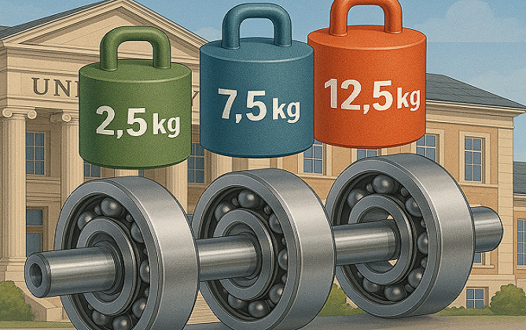

# Ball bearing predictive AI challenge aneb ‚NALOŽ MU TO‘

# Group of Applied Mathematics &amp; Stochastics
**(Katedra matematiky FJFI ČVUT &amp; NDT laboratoř ÚT AV ČR, v.v.i.)** \
hledá AMSM talenty na zpracování dat a aplikace STROJOVÉHO UČENÍ

#### Co je Akustická Emise
Akustická emise (AE) je jev, při kterém se do materiálu uvolňují elastické napěťové vlny o frekvencích v řádu až MHz, tedy daleko nad slyšitelnou částí frekvenčního spektra. Po dosažení povrchu tělesa lze tyto vlny měřit piezoelektrickými snímači a detekovat tak např. mikroskopický růst trhlin (únava materiálu), netěsnost tlakových nádob (jaderných či chemických reaktorů), tření v ložiscích a převodových ústrojích apod. Pokud má AE charakter příliš častých pulzů, které splývají v signál podobný spíše šumu, mluvíme o spojité AE.

#### Měřící set-up
Zatěžovací experimentální aparatura obsahovala elektromotor typu m5120-4025GN-5K o výkonu 120W a točivém momentu 3,5 Nm s předřazeným potenciometrem. Motor pohání ocelovou hřídel, na níž jsou nasazena celkem tři ložiska typu UC 205 šířky 15mm s vnitřním průměrem 25 mm. Krajní ložiska jsou uchycena v ložiskových domcích, pevně spojena s hliníkovým rámem. Prostřední ložisko je uchyceno v domku typu UCT 205, který není s rámem nijak spojen a celá jeho váha tak spočívá na hřídeli. Ocelový trn ze závitové tyče umožňuje přímé zatížení prostředního ložiska pomocí ocelových kotoučů.

#### RAW data
USB osciloskopem Handyscope HS6 DIFF se snímala akustická emise produkovaná ložisky při různém zatížení a při fixovaných otáčkách motoru 700 ot./min. Byly použity 4 nerezové magnetické piezoelektrické snímače MDK13 s poniklovanou styčnou plochou. Akustická emise byla pro každou úroveň zatížení měřena po dobu 30 sekund se vzorkovací frekvencí 1,5625 MHz, tedy 47 milionů hodnot na každé měření. Celkem bylo naměřeno X úrovní zatížení, z nichž poskytujeme k trénování data ze čtyř nosných zatížení: 2,5kg / 7,5kg / 12,5kg / 17,5kg.

#### Struktura dat ke klasifikaci
Pro snadnější manipulaci se signály byly vybrány z každého měření při daném zatížení podúseky délky 5000 vzorků s náhodně rovnoměrnými počátky vybíraných úseků z celé délky původních AE signálů. Pro trénovací úrovně zatížení ložiska byl vybrán následující počet vzorků: 2,5kg - 1605 podúseků. 7,5kg – 1579 podúseků, 12,5kg – 1600 podúseků, 17,5kg – 1632 podúseků, celkem tedy 6416 úseků akustických ultrazvukových signálů s s příslušnou hodnotou zatížení v gramech (response variable).

#### Úkol pro klasifikaci a predikci zatížení ložiska
Finální soubor ke klasifikaci a predikci zatížení obsahuje 3200 náhodných úseků AE signálů z různých experimentálních zatížení ložiska. Úkolem soutěžících je predikovat u každého neznámého signálu správnou velikost zatížení v [g] v intervalu [0g,19200g], při kterém byl tento příslušný AE signál naměřen.

#### Hodnocení kvality klasifikace a predikce 
Ze zaslaného vektoru predikovaných zátěží v [g], bude spočten celkový výběrový MAE (sample mean absolute error) všech vámi dosažených 3200 predikovaných odchylek od skutečného experimentálního zatížení ložiska. Podle dosažené sMAE budou seřazeny výsledky soutěžících a uděleny ceny (viz web link [GAMS](https://gams.fjfi.cvut.cz/bearing-challenge)).

Vaše predikce zašlete prosím na adresu kusvacla@fjfi.cvut.cz
